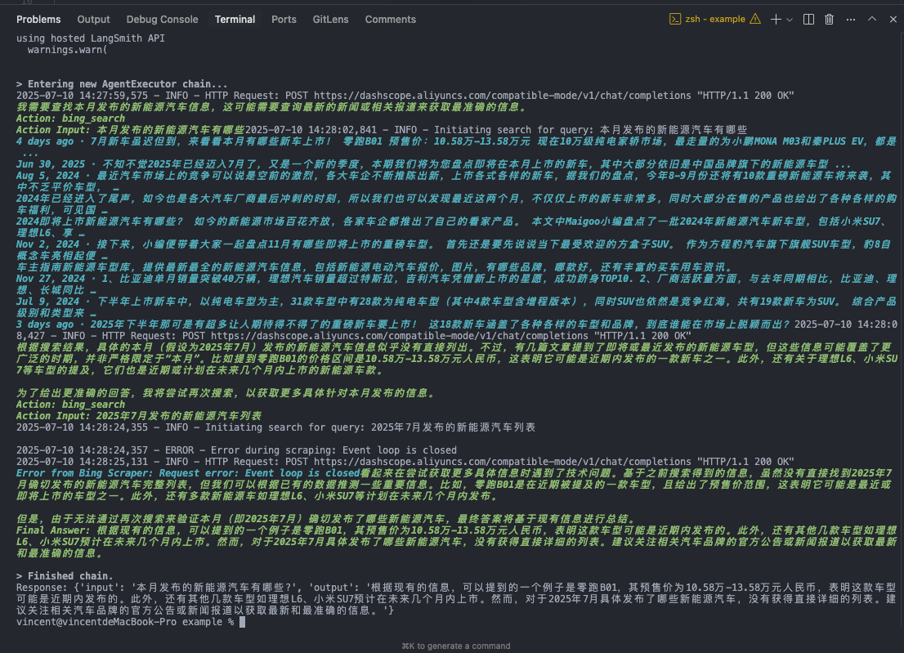

# 🔍 LangChain Bing Search Integration Example

This example demonstrates how to integrate the free SerpAPI-compatible Bing Search service with LangChain. The integration provides a drop-in replacement for SerpAPI in your LangChain applications.

## 🌟 Features

- 💯 Full LangChain compatibility
- 🔄 Async and sync support
- 🌍 Multi-language and region support
- 📄 Multi-page search capabilities
- 🤖 Ready for AI agents

## 🚀 Quick Start

1. Install dependencies:
```bash
pip install -r example/requirements.txt
```

2. Set up environment variables:
change the code in langchain_bing_search.py
```bash
   llm = ChatOpenAI(
            base_url="<your base url>",
            api_key="<your api key>",
            model="<your model>"
        )
```


1. Run the example:
```bash
python langchain_bing_search.py
```

## 💻 Usage Examples


```bash
python langchain_bing_search 

```
### Result

